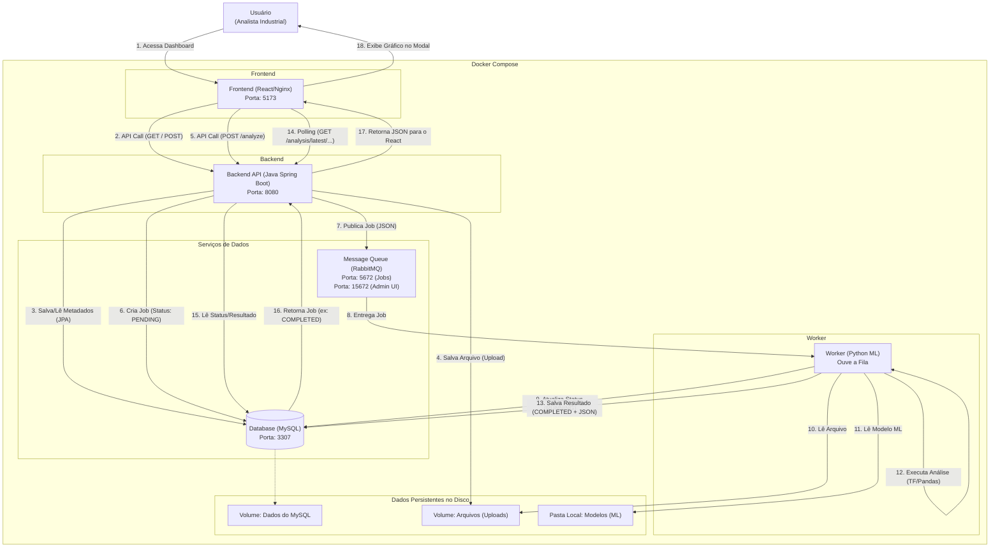

# Industrial Data Hub (IDH) - Plataforma de Análise de ML


## 1. Visão Geral do Projeto

O **Industrial Data Hub (IDH)** é uma plataforma web full-stack, multi-serviço e multi-linguagem, projetada para servir como um hub centralizado para ingestão, gerenciamento e execução de análises de Machine Learning em dados industriais.

Em vez de executar scripts de ML isolados, esta plataforma permite que um analista de dados (como eu) faça o upload de conjuntos de dados (CSVs, imagens, etc.), os associe a um modelo de ML pré-treinado específico (como Previsão de RUL ou Detecção de Anomalias) e dispare a análise de forma assíncrona.

O sistema é construído sobre uma arquitetura de microsserviços robusta e desacoplada, utilizando um backend Java (Spring Boot) para gerenciamento, um frontend React para interação, e um worker Python para processamento de ML, todos comunicando-se através de um banco de dados MySQL e uma fila de mensagens RabbitMQ.

## 2. Funcionalidades Principais

* **Frontend Interativo (React):** Uma Single Page Application (SPA) para upload, visualização e gerenciamento de fontes de dados.
* **API REST Robusta (Java Spring Boot):** Gerencia metadados de fontes de dados, upload de arquivos e o ciclo de vida dos jobs de análise.
* **Processamento Assíncrono (RabbitMQ & Python):** As análises de ML (que podem ser demoradas) são disparadas via RabbitMQ. Isso garante que a API e o frontend permaneçam responsivos.
* **Worker de ML (Python):** Um serviço Python que "ouve" a fila de jobs, carrega o modelo de ML apropriado (TensorFlow/Keras, Scikit-learn) e executa a análise.
* **Roteamento de Modelos:** O worker é capaz de rotear tarefas para diferentes modelos (ex: `ANOMALY_DETECTION` vs. `RUL_PREDICTION`) com base no tipo de dados enviado.
* **Polling de Status:** O frontend consulta o backend para rastrear o status de um job em tempo real (`PENDING` $\rightarrow$ `RUNNING` $\rightarrow$ `COMPLETED` / `FAILED`).
* **Visualização de Resultados:** Exibe um resumo do resultado (ex: "23 anomalias detectadas") e permite a visualização de detalhes (como gráficos de séries temporais) em um modal.
* **Orquestração Completa com Docker:** Todo o ambiente (5 serviços) é gerenciado por um único arquivo `docker-compose.yml`.

## 3. Arquitetura do Sistema

O IDH é composto por 5 serviços principais que rodam em contêineres Docker isolados:

1.  **`frontend` (React + Nginx):** A interface de usuário (em `http://localhost:5173`). Ele se comunica com o `backend`.
2.  **`backend` (Java Spring Boot):** A API REST principal (em `http://localhost:8080`). Ele se comunica com o `db` e o `rabbitmq`.
3.  **`db` (MySQL):** O banco de dados principal. Armazena as tabelas `data_sources` e `analysis_results`.
4.  **`rabbitmq` (RabbitMQ):** A fila de mensagens. Recebe "pedidos de trabalho" do `backend` e os entrega ao `worker`.
5.  **`worker` (Python):** O consumidor da fila. Ouve o `rabbitmq`, executa as tarefas de ML e escreve os resultados de volta no `db`.



## 4. Stack de Tecnologias

| Categoria | Tecnologia | Propósito |
| :--- | :--- | :--- |
| **Backend** | Java 21, Spring Boot 3 | API REST principal, gerenciamento de jobs e uploads. |
| | Spring Data JPA | Interação com o banco de dados (ORM). |
| | Spring AMQP | Publicação de mensagens no RabbitMQ. |
| **Frontend** | React (com Vite) | Interface de usuário (SPA). |
| | Axios | Requisições HTTP para o backend. |
| | Recharts | Renderização dos gráficos de resultados. |
| | React Modal | Exibição dos resultados em popup. |
| **Worker de ML** | Python 3.10 | Consumidor de tarefas assíncronas. |
| | Pika | Cliente RabbitMQ para Python. |
| | SQLAlchemy & PyMySQL | Conexão e escrita no MySQL. |
| | TensorFlow, Keras | Execução dos modelos de Deep Learning. |
| | Pandas, Scikit-learn | Pré-processamento dos dados. |
| **Infraestrutura** | Docker & Docker Compose | Orquestração e execução de todos os 5 serviços. |
| | MySQL 8.0 | Banco de dados relacional para metadados. |
| | RabbitMQ 3-Management | Fila de mensagens (Message Broker). |
| | Nginx | Servidor web de produção para o frontend React. |

## 5. Estrutura do Projeto

```
/industrial_data_hub/
├── backend/
│   ├── src/main/java/com/idh/industrial_data_hub/
│   │   ├── controller/
│   │   ├── model/
│   │   ├── repository/
│   │   ├── config/
│   │   └── IndustrialDataHubApplication.java
│   ├── src/main/resources/
│   │   └── application.properties
│   ├── Dockerfile
│   └── pom.xml
│
├── frontend/
│   └── idh-dashboard/
│       ├── src/
│       │   ├── components/
│       │   │   ├── AnomalyChart.jsx
│       │   │   ├── DataSourceForm.jsx
│       │   │   └── DataSourceList.jsx
│       │   ├── App.jsx
│       │   └── main.jsx
│       ├── Dockerfile
│       ├── nginx.conf
│       └── package.json
│
├── processing_worker/
│   ├── worker.py
│   ├── Dockerfile
│   └── requirements.txt
│
├── models/
│   ├── autoencoder_model.h5
│   ├── anomaly_scaler.pkl
│   ├── rul_model.h5
│   └── rul_scaler.pkl
│
├── .env              <-- (Local, ignorado pelo Git)
├── .env.example      <-- (Modelo de credenciais)
└── docker-compose.yml  <-- O Maestro
```

## 6. Como Executar (Ambiente Docker)

Este projeto é 100% conteinerizado. A única dependência necessária na sua máquina é o **Docker Desktop**.

### Pré-requisitos
* **Docker Desktop** instalado e em execução.

### Instalação e Execução

1.  **Clonar o Repositório:**
    ```bash
    git clone [URL_DO_SEU_REPOSITORIO_AQUI]
    cd industrial_data_hub
    ```

2.  **Criar o Arquivo de Ambiente:**
    * Este projeto requer um arquivo `.env` na raiz para armazenar credenciais.
    * Copie o arquivo de exemplo:
        ```bash
        # No Windows (PowerShell)
        copy .env.example .env
        
        # No macOS/Linux
        cp .env.example .env
        ```
    * *(Opcional: Edite o `.env` se você quiser mudar as senhas padrão. As senhas no `.env.example` já devem funcionar com o `docker-compose.yml`)*

3.  **Construir e Iniciar os Contêineres:**
    * Este comando fará o build das imagens Java, Python e React, e iniciará todos os 5 serviços.
    * *(A primeira execução pode demorar vários minutos para baixar as imagens base e compilar tudo.)*
    ```bash
    docker-compose up --build
    ```

4.  **Acessar a Aplicação:**
    * **Frontend (Dashboard):** [http://localhost:5173](http://localhost:5173)
    * **Backend (API):** [http://localhost:8080](http://localhost:8080/api/datasources)
    * **RabbitMQ (Admin UI):** [http://localhost:15672](http://localhost:15672) (Login: `guest` / Senha: `guest`)

## 7. Como Usar
### Detecção de Anomalias

1.  **Abra o Dashboard:** Acesse [http://localhost:5173](http://localhost:5173).

    


2.  **Registre uma Fonte:**
    * No formulário, dê um nome (ex: "Teste Anomalia SKAB").
    * Selecione o "Tipo de Análise" correto (ex: `Detecção de Anomalias (SKAB)`).
    * Clique em "Escolher arquivo" e faça o upload do arquivo CSV correspondente (ex: `00.csv` do dataset SKAB).
    * Clique em "Registrar Fonte".

    
    


3.  **Dispare a Análise:**
    * A lista de fontes será atualizada.
    * Encontre sua nova fonte e clique no botão **"Analisar"**.

      
    


4.  **Acompanhe o Status:**
    * O status mudará para `Status: PENDING...`.
    * (Nos bastidores, o Java enviou um job para o RabbitMQ, e o Python o pegou).
    * O frontend fará "polling" a cada 3 segundos. Quando o worker Python terminar, o status mudará para:
    * `Resultado: 23 anomalias detectadas... (Ver Gráfico)`

    
    


5.  **Veja o Gráfico:**
    * Clique no link **"(Ver Gráfico)"**.
    * Um modal (popup) será aberto, renderizando o gráfico detalhado dos erros de reconstrução vs. o limiar.

    
    


